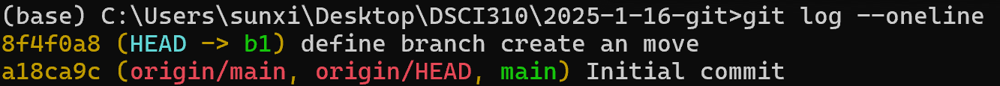

# 2025-1-16-git
git branch

- `git branch`: list all branches on your local computer, and the current branch shows as green with a star
- `git branch <name>`: create a new branch named '<name>' locally, where 'HEAD' is
- `git switch b1`: switch to the branch b1
- `git log --oneline`: see where you are now
- `git log --oneline --graph`: help you see the commit/branch entries
(after add and commit:)

- `git switch main` : the file you changed (on b1) becomes the original one (on main)
- `git log --oneline --graph --all`: see all branches

- `git push origin b1`: pushes the b1 branch to the remote
- `git pull origin b1`: pulls the b1 branch from the remote

pull the branch to the local main branch
- `git switch main`
- `git pull origin main`